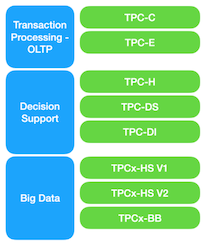
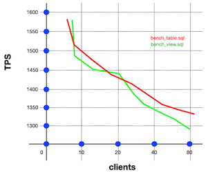
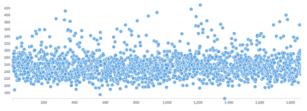
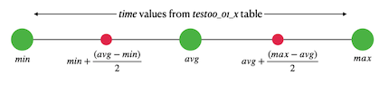

# Day 05 - Database Boot camp

Benchmarking

*Resume: Today you will find out techniques how to measure latency and TPS of your model and database *

💡 [Tap here](https://new.oprosso.net/p/4cb31ec3f47a4596bc758ea1861fb624) **to leave your feedback on the project**. It's anonymous and will help our team make your educational experience better. We recommend completing the survey immediately after the project.

## Contents

1. [Chapter I](#chapter-i) \
    1.1. [Preamble](#preamble)
2. [Chapter II](#chapter-ii) \
    2.1. [General Rules](#general-rules)
3. [Chapter III](#chapter-iii) \
    3.1. [Rules of the day](#rules-of-the-day)  
4. [Chapter IV](#chapter-iv) \
    4.1. [Exercise 00 - Let’s measure our possibilities!](#exercise-00-measure-our-possibilities)  
5. [Chapter V](#chapter-v) \
    5.1. [Exercise 01 - Let’s measure our possibilities in detail!](#exercise-01-measure-our-possibilities-in-detail)
6. [Chapter VI](#chapter-vi) \
    6.1. [Exercise 02 - Need statistics by intervals](#exercise-02-need-statistics-by-intervals)   

<h2 id="chapter-i" >Chapter I</h2>
<h2 id="preamble" >Preamble</h2>

 [http://www.tpc.org](http://www.tpc.org)

Standards, standards ... they are everywhere.  If you think that your solution / model / architecture are unique, then you are mistaken.  Everything has been standardized for a long time, the main thing is to find documentation describing these official standards.
Standardization also affected benchmarking of load testing of relational databases and Big Data databases.

 

There are many standardized benchmark database tests, and which one to choose to start with?
If we consider the database from the OLAP / OLTP side, then two tests can be distinguished
- TPC-C  On-Line Transaction Processing Benchmark for 5 concurrent transactions
- TPC-H Decision Support Benchmark (~ OLAP) for complex SQL

The question remains open - what exactly to test and how to understand that your model and the Database meet standardization on the whole?
The main parameters that are tested are:
- TPS (number of completed business transactions per second)
- Latency (the execution time of your request from its start to the receipt of the last row on the side of the calling client)
- other parameters are essentially correlations with the received TPS and latency metrics
    - Database Size VS TPS / latency
    - Amount of client connections VS TPS / latency
    - Latency VS Replication
    - etc.

 

What if your TPS / latency test fails and your database doesn't meet any standardization?  There is only one answer here - finding bottlenecks, optimization, denormalization / normalization of the logical and then physical model, setting up the database server configuration, etc.  In general, it all looks exactly as shown in the figure on the left! :-)

<h2 id="chapter-ii">Chapter II</h2>
<h2 id="general-rules" >General Rules</h2>

- Use this page as the only reference. Do not listen to any rumors and speculations on how to prepare your solution.
- Please make sure you are using the latest version of PostgreSQL.
- Please make sure you have installed and configured the latest version of Flyway by Redgate.
- Please use our [internal SQL Naming Convention rules](https://docs.google.com/document/d/1IxIOFUeb-8Z8fBOfkXiy4SkN-J1mPIXveJZUCNZFdp8/edit?usp=sharing)
- Please use our [Terms and Definitions](https://docs.google.com/document/d/1_ZTDpHcfYMASZ5BtnldurQLF0fJygGF1yuTwik0DOqk/edit?usp=sharing) document
- That is completely OK if you are using IDE to write a source code (aka SQL script) and make a syntax check before migration at the final database solution by Flyway.
- Comments are also good in the SQL scripts. Anyway be careful with signs /\*...\*/ directly in SQL. These special symbols are used for Database Hints to improve SQL performance and these are not just comment marks :-).
- Pay attention to the permissions of your files and directories.
- To be assessed your solution must be in your GIT repository.
- Your solutions will be evaluated by your piscine mates.
- You should not leave in your directory any other file than those explicitly specified by the exercise instructions. It is recommended that you modify your .gitignore to avoid accidents.
- Do you have a question? Ask your neighbor on the right. Otherwise, try with your neighbor on the left.
- Your reference manual: mates / Internet / Google.
- Read the examples carefully. They may require things that are not otherwise specified in the subject.
- And may the SQL-Force be with you!
- Absolutely everything can be presented in SQL! Let’s start and have fun!

<h2 id="chapter-iii">Chapter III</h2>
<h2 id="rules-of-the-day">Rules of the day</h2>

- Please make sure you have a separated database “data” on your PostgreSQL cluster. 
- Please make sure you have a database schema “data” in your “data” database.
- Please make sure you are working through database user “data” and password “data” with super admin permissions for your PostgreSQL cluster. 
- Each exercise of the day needs a Flyway tool for right versioning of the “data” database through user “data”.
- Please make changes in your “flyway.conf” file (located in “~/flyway-6.x.x/conf” directory) directly to configure a right and stable connection to your PostgreSQL database.

    - flyway.url = jdbc:postgresql://hostname:5432/data 
        - where hostname is DNS / IP address of PostgreSQL server 
        - where port is a port of PostgreSQL server , by default is 5432
        (jdbc:postgresql://localhost:5432/data OR  jdbc:postgresql://127.0.0.1:5432/data)
    - flyway.user = data
    - flyway.password = data
    - flyway.schemas = data
    - flyway.defaultSchema = data
- Please use the command line for Flyway to migrate changes into the database and get information about the current version from the database.
- Please don’t append additional parameters for “flyway” in a command line, all needed parameters should be changed in “flyway.conf” file
- All tasks contain a list of Allowed and Denied sections with listed database options, database types, SQL constructions etc. Please have a look at the section before you start.

<h2 id="chapter-iv">Chapter IV</h2>
<h2 id="exercise-00-measure-our-possibilities">Exercise 00 - Let’s measure our possibilities!</h2>

| Exercise 00: Let’s measure our possibilities! |                                                                                                                          |
|----------------------------------------------|--------------------------------------------------------------------------------------------------------------------------|
| Turn-in directory                            | ex00                                                                                                                     |
| Files to turn-in                             | `V500__create_country_indicator_original.sql` 2 user-defined custom pgbench scripts 2 entered command lines to run pgbench with parameters  2 screenshots with pgbench output results for each benchmark   text file ratio.txt with value of ratio comparison between TPS (excluding connections establishing)  1 screenshot of graphical visualization of correlation between TPS value and amount of parallel clients                                                                                   |
| **Allowed**                                      |                                                                                                                          |
| Additional Tools                                    | pg_bench |
| **Denied**                                       |                                                                                                                          |
| Static ID                                    | Do not use in benchmarks Static ID! |

Alien SQL Performance Engineer decided to measure two different TPS (Transaction Per Second) metrics and then compare them between database view from one side and ordinary database table from other side. Which database object will be faster? (actually, there is a rumor about using ordinary database table is faster then using database view for the same table)

Before this challenge, please create a new database view `v_country_indicator_original` with the source code below using flyway (please remember, we are always using flyway tool for any modification of any objects in the database to prevent any misunderstandings during Release Day). Please use `V500__create_country_indicator_original.sql` file name to describe SQL script below. Comments please :-) !

`create view v_country_indicator_original as `  
`   select * `  
`     from country_indicator;`

Let's help Alien SQL Performance Engineer in his research of the TPS metric for both cases.  To do this, we will use the pgbench tool that comes with standard installation of PostgreSQL.  Aliens found the manual and posted it [here](https://www.postgresql.org/docs/12/pgbench.html).

- it is necessary to create 2 separate custom user benchmark scripts to measure the **TPS** metrics for **ordinary database table** `country_indicator` and for database view `v_country_indicator_original`
    - please use `bench_table.sql` file name for benchmarking of `country_indicator` table 
    - please use `bench_view.sql` file name for benchmarking of `v_country_indicator_original` database view 

- pattern of the pgbench-script is given below
Note that `:id` is a parameter (or bind variable) and it has to be initialized at the `\set` block level in the benchmark script.  Make it random and set range from 1 to 10 000 000, we do not care that it should match the existing id from the table. Our goal is to load the database as maximum as possible.

`\set  initialize_random_for_id`  
`BEGIN;`  
`   SELECT * FROM db_object_name WHERE id = :id;`  
`END;`  

- run pgbench one by one for each custom script with the following keys
    - indicating your custom script (`-f path_to_file`)
    - indicating the benchmark running time of 180 seconds (-T 180)
    - number of concurrent users 10 (-c 10)
    - detailed output of average execution time in ms for each operation from user file (-r)
    - get the ratio (please save ratio value into the text file ratio.txt) value by the formula below between both TPS (excluding connections establishing) metrics for both cases (please round a result to 6 decimals value). `ratio = TPS(v_country_indicator_original) / TPS(country_indicator)`

An example of pgbench usage from the command line:

`pgbench -h localhost -p 5432 -U data -f /opt/scripts/sql/my_first_test.sql -c 5 -r -T 180 data`

The sample of pgbench output:

`...`  
`scaling factor: 1`  
`query mode: simple `  
`number of clients: 4`  
`number of threads: 1`  
`number of transactions actually processed: 35988`  
`latency average: 0.422 ms`  
`tps = 599.815927 (including connections establishing)`  
`tps = 599.066870 (excluding connections establishing)`  
`statement latencies in milliseconds:`  
`...`  

- Let’s measure how our database will work under loading for different amounts of concurrent connections. Run pgbench tool for each custom script for the next series of following keys 
    - indicating your custom script (`-f path_to_file`)
    - indicating the benchmark running time of 180 seconds (-T 180)
    - number of concurrent users 20 (-c 20), then 40 (-c 40), then 80 (-c 80)

At the end, please present graphical visualization for correlation between TPS value and amount of parallel clients  (you can use MS Excel tool for example). Sample of visualization is below.

<h2 id="chapter-v">Chapter V</h2>
<h2 id="exercise-01-measure-our-possibilities-in-detail">Exercise 01 - Let’s measure our possibilities in detail!</h2>

| Exercise 01: Let’s measure our possibilities in detail! |                                                                                                                          |
|----------------------------------------------|--------------------------------------------------------------------------------------------------------------------------|
| Turn-in directory                            | ex01                                                                                                                     |
| Files to turn-in                             | `V600__create_tables_for_benchmarks.sql` `V610__create_view_bench_comparison.sql` `V620__create_views_get_time_client0_01.sql` an archived csv log-file for each custom script text file `copy_sql.txt` with COPY commands for loading data into two tables screenshot with database view results (through psql command line or any IDE (pgAdmin, DataGrip)) 2 screenshots of graphical visualization of each latency metric for both benchmarks                                                                                   |
| **Allowed**                                      |                                                                                                                          |
| Additional Tools                                    | pgbench |
| SQL keywords                                    | COPY |
| **Denied**                                       |                                                                                                                          |
| Static ID                                    | Do not use in benchmarks Static ID! |

“The results obtained showed the average TPS for both cases and this is not very indicative.  I need details and a new latency metric!”  - exclaimed Alien SQL Performance Engineer.

Let's help Alien SQL Performance Engineer  figure it out and for this we will execute a call to pgbench with an additional key (-l OR --log) for each prepared custom script from the previous exercise.  This key will enable all completed transactions to be unloaded to a file (per-transaction logging) within a custom script.  As a result, you will get a CSV file with the pgbench_log.nnn naming pattern (it will be in the current directory - from where you run the benchmark) with the following fields `{client_id transaction_no time script_no time_epoch time_us}`.

The following tasks need to be done
- run pgbench one by one for each custom script with the following keys
    - indicating your custom script (`-f path_to_file`)
    - indicating the benchmark running time of 60 seconds (-T 60)
    - number of concurrent users 10 (-c 10)
    - do per-transaction logging and get two files with detailing (-l)

An example of pgbench usage from the command line with per-transaction logging :

`pgbench -h localhost -p 5432 -U data -f /opt/scripts/sql/my_first_test.sql -c 5 -l -r -T 60 data`

- load the resulting files using PostgreSQL COPY command into two different tables with the names `test00_01_1` (for results of benchmarking for database view `v_country_indicator_original`) and `test00_01_2`  (for results of benchmarking for table `country_indicator`) with the table structure that matches the CSV file fields. To create tables before please use flyway file `V600__create_tables_for_benchmarks.sql`.

|Column Name | Data Type |
| ------ | ------ |
|client_id|BIGINT|
|transaction_no|BIGINT|
|time|BIGINT|
|script_no|BIGINT|
|time_epoch|BIGINT|
|time_us|BIGINT|

Please save your both COPY commands into `copy_sql.txt` file.

- create a database view `v_compare_test_results` returning data based on two tables with loaded data on the time column (corresponding to the time attribute in the resulting CSV file) in the following format. Please use flyway file `V610__create_view_bench_comparison.sql` to describe a creation of the new database view.

| Object Name | Maximum time | Minimum time | Average time |
| ------ | ------ | ------ | ------ |
| v_country_indicator_original | 2513 | 140 | 890.28711... |
| country_indicator | 3018 | 67 | 945.87671... |

- present two separated graphical presentations of column time from `test00_01_1` and `test00_01_2` tables for `client_id = 5` and ordering by two columns `time_us, transaction_no`. Before it, please create 2 additional database views `v_test00_01_1` and `v_test00_01_2` to prepare a dataset to visualize a result. Please create a new flyway file `V620__create_views_get_time_client0_01.sql` to describe a creation of the new database views. It’s completely up to you, how to visualize data. You can use any tool or programming language (for example Python with Pandas or Matplotlib libraries).

The part of graphical presentation is below (Axe Y corresponds time column value, axe X corresponds index or number of returning row).

<h2 id="chapter-vi">Chapter VI</h2>
<h2 id="exercise-02-need-statistics-by-intervals">Exercise 02 - Need statistics by intervals</h2>

| Exercise 02: Need statistics by intervals |                                                                                                                          |
|----------------------------------------------|--------------------------------------------------------------------------------------------------------------------------|
| Turn-in directory                            | ex02                                                                                                                     |
| Files to turn-in                             | `V700__v_intervals_distribution.sql` screenshot with database view results (through psql command line or any IDE (pgAdmin, DataGrip))                                                                                   |
| **Allowed**                                      |                                                                                                                          |
| Operators                                    | Standard DDL / DML operators to create / alter relations and to insert / update / delete / select data (CRUD operations) |
| Functions                                    | `repeat` `round` `ceil` `max` `min` `count` `avg` `string_agg(DISTINCT ... )` |

Alien SQL Performance Engineer cannot stop at the obtained metrics and wants to understand in what intervals the values ​​of the time column from the tables `test00_01_1` and `test00_01_2` fell.

To help with this task, you need to take the following steps
- calculate intervals based on the logic below for `client_id = 9` for each `test00_01_x` table. It is necessary to calculate the values ​​of the red points (please round all calculated values to 2 decimals)

Then to get 3 intervals

- based on these intervals, count the number of records from corresponding tables `test00_01_x` that are inside them by the value of the time field for `client_id = 9`

- using the repeat(...) function , get a conditional ANSI “graphic image” of the data histogram,based on the repeating character “|”, the number of characters for output is calculated by the formula `⎡(x ⋅ 100) / count⎤`, where x - value from database view column “Amount of Rows”, count - total amount of rows in a table, brackets ⎡...⎤ mean rounding to the nearest higher integer

- show “Percent” column value from previous point, just repeat the formula `⎡(x ⋅ 100) / count⎤`, where x - value from database view column “Amount of Rows”, count - total amount of rows in a table, brackets ⎡...⎤ mean rounding to the nearest higher integer

- do all this within one SQL query by creating a database view `v_intervals_distribution`. Please use flyway file `V700__v_intervals_distribution.sql` to describe creation of the new database view.

- an example of the result is given below (the result must be sorted by the table name and by the order of the interval number)

| Table Name | Interval | Amount of Rows | Histogram | Percent |
| ------ | ------ | ------ | ------ | ------ |
| `test00_01_1` | [23, 300) | 100 | .. | 2 |
| `test00_01_1` | [300, 800) | 3240 | ........... | 97 |
| `test00_01_1` | [800, 1200] | 5 | . | 1 |
| `test00_01_2` | [50, 500) | 55 | .. | 2 |
| `test00_01_2` | [501, 974) | 4391 | ........... | 96 |
| `test00_01_2` | [974, 1485] | 99 | .. | 2 |

